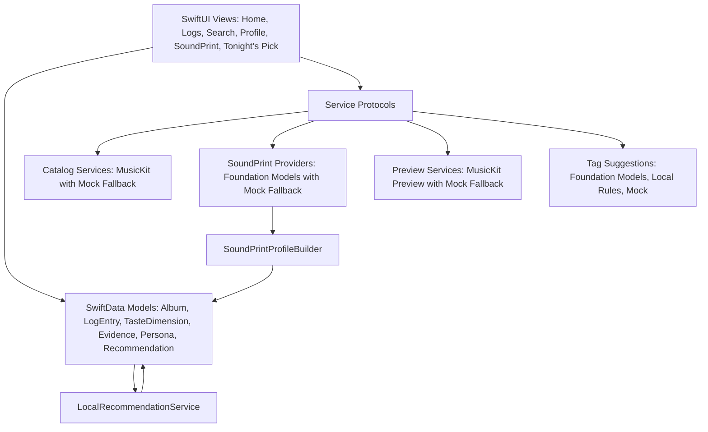
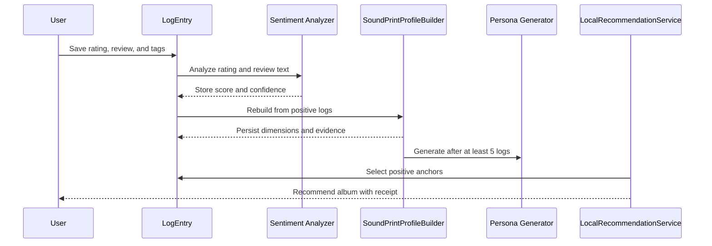
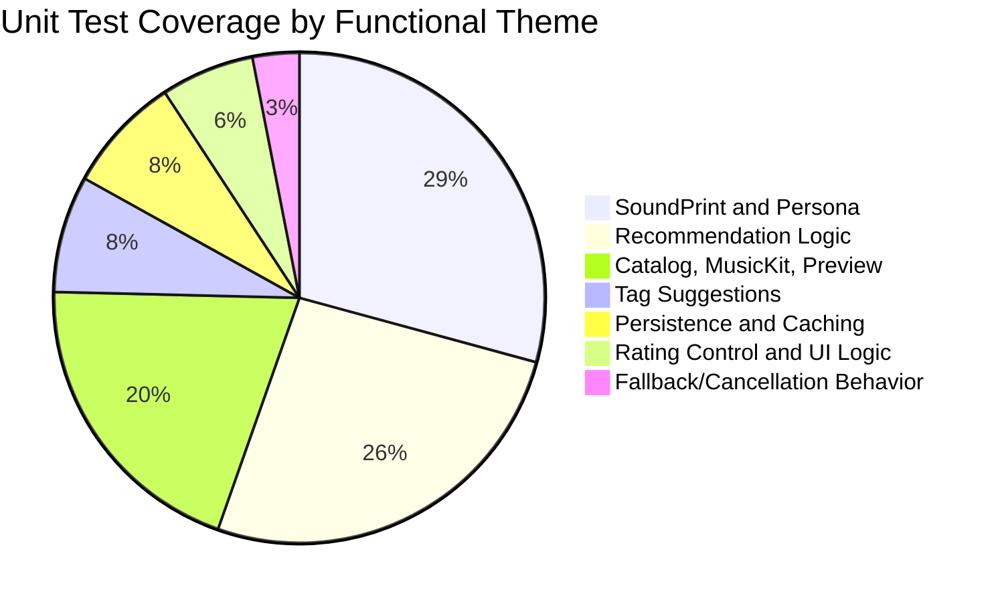

# Listend: A Local-First Music Diary with Evidence-Backed Taste Modeling

## Abstract

Listend is an iOS music diary designed to let users log albums, rate listening experiences, write short reviews, assign tags, and receive evidence-backed music recommendations. The project responds to a common weakness in mainstream music recommendation systems: listening history alone does not reliably distinguish between music a user enjoyed, disliked, ignored, or merely sampled. Listend addresses this problem by treating explicit user-authored logs as the primary source of taste data. Its SoundPrint layer converts ratings, reviews, and tags into sentiment scores, taste dimensions, persona summaries, and one-album recommendations with receipts. The implemented prototype uses SwiftUI, SwiftData, MusicKit-backed services with mock fallbacks, and optional Apple Foundation Models integration behind protocol abstractions. Testing shows that the core logic is deterministic and resilient: sentiment scoring, taste extraction, persona generation, recommendation ranking, fallback handling, catalog mapping, tag suggestion, and receipt persistence are covered by 65 passing unit tests. The project demonstrates that a local-first, explainable recommendation workflow can remain useful before large-scale collaborative filtering or cloud personalization are introduced, although recommendation quality remains limited by sparse user data, small candidate pools, and heuristic modeling.

## Introduction

### Problem Statement

Most music platforms infer user preference from streams, skips, saves, and broad engagement signals. These signals are useful at scale, but they often flatten user intent. A listener may stream an album because it is new, culturally relevant, assigned for a class, or played by someone else. That interaction does not necessarily indicate enjoyment. As described in the Listend MVP Product Requirements Document, the app is motivated by the observation that recommendation systems often fail when they treat listening history as a flat positive signal and provide weak explanations for recommendations.

Listend reframes recommendation as a reflective logging problem. Instead of beginning with hidden behavioral telemetry, it begins with explicit evaluations: ratings, reviews, tags, and negative opinions. The app's guiding principle is that logging must never be blocked by AI, MusicKit, playback, or recommendation failures. This creates a practical research and engineering question: can a mobile music diary produce useful taste modeling and explainable recommendations using local user-authored evidence first, while still allowing richer catalog and language-model integrations later?

### Objectives

The project has five primary objectives:

| Objective | Implementation Evidence |
|---|---|
| Build a local-first album logging experience | SwiftData models for albums, logs, taste dimensions, personas, recommendations, receipts, and feedback |
| Preserve usability without external services | Mock catalog, mock recently played albums, mock SoundPrint provider, and local tag suggestion fallback |
| Convert logs into taste signals | Rule-based sentiment scoring, keyword-based taste extraction, positive-evidence filtering, and persona generation |
| Recommend one album at a time with explanations | Local recommendation scoring, active recommendation reuse, feedback persistence, and source-log receipt snapshots |
| Prepare for real integrations without rewriting the app | Protocol-based MusicKit, preview, tag suggestion, and Foundation Models providers with fallback wrappers |

## Literature Review

Recommender-system literature commonly distinguishes content-based, collaborative, and hybrid approaches. Adomavicius and Tuzhilin (2005) describe these families and argue that stronger recommendation systems often require richer understanding of users, items, context, and multi-criteria preference. Listend aligns with this direction by modeling ratings, review language, tags, sentiment, and taste dimensions rather than reducing preference to a single implicit interaction count.

Content-based recommendation is especially relevant to Listend because the app recommends based on item attributes and user-specific evidence. Lops, de Gemmis, and Semeraro (2011) describe content-based systems as matching item attributes against profiles of user interests. Listend's MVP uses a compact version of this idea: it extracts attributes from liked albums, tags, genre names, release eras, and SoundPrint evidence, then searches or ranks candidate albums against those signals.

The project also reflects research on explainable recommendations. Tintarev and Masthoff (2007, 2012) identify explanation goals such as transparency, trust, effectiveness, scrutability, satisfaction, and efficiency. Listend's "receipt" model directly supports transparency by storing the source album, artist, rating, snippet, and linked dimension behind a recommendation. The explanation is not merely decorative text; it is persisted as structured evidence that can survive later deletion of the source log.

Sentiment analysis is another key influence. Liu (2012) defines sentiment analysis and opinion mining as computational analysis of opinions, sentiments, evaluations, attitudes, and emotions in written language. Listend's MVP does not attempt full natural language understanding. Instead, it uses a controlled, deterministic sentiment heuristic: ratings establish a base score, positive keywords increase the score, negative keywords reduce it, scores are clamped between -1 and 1, and confidence depends on whether review text exists. This limited approach is technically appropriate for an MVP because it is explainable, testable, and safe to use as a fallback.

Finally, the Apple platform architecture shapes the implementation. SwiftUI supports declarative UI composition and data flow through view hierarchies, while SwiftData's `ModelContainer` manages schema, storage configuration, contexts, and persistence. Apple Foundation Models provide an on-device language-model framework for language understanding, structured output, and tool calling. Listend uses these platform capabilities conservatively: SwiftData is the durable local store, SwiftUI is the presentation layer, and Foundation Models are optional behind validation and fallback logic rather than required for core logging.

## Methodology

### System Architecture

Listend uses a layered, local-first architecture. The current implementation is compact enough to avoid heavy repository abstractions, but its service boundaries isolate risky integrations.



The architecture follows three engineering principles from the technical specification: compile after every phase, keep logging independent from AI, and use protocols around risky dependencies. `ListendApp.swift` constructs service implementations based on execution context. UI tests use mocks. Simulator builds use mock SoundPrint and mock tag suggestions. Device builds can use Foundation Models and MusicKit through fallback wrappers.

### Data Model

The data model stores both user inputs and generated interpretation artifacts.

| Model | Purpose | Key Fields |
|---|---|---|
| `Album` | Cached catalog entity | title, artist, release year, genre, artwork URL, Apple Music ID |
| `LogEntry` | User-authored album log | rating, review text, tags, sentiment score, confidence, timestamps |
| `TasteDimension` | Aggregated SoundPrint profile dimension | name, label, weight, confidence, summary |
| `TasteEvidence` | Stored evidence for a dimension | dimension name, source log ID, snippet, strength, confidence |
| `SoundPrintPersona` | Short generated taste summary | persona text, generation date, log count |
| `Recommendation` | One active or historical album pick | album, score, confidence, status, explanation |
| `RecommendationReceipt` | Explanation evidence snapshot | source album, artist, rating, snippet, linked dimension |
| `RecommendationFeedback` | User response to recommendation | recommendation ID, feedback type, creation date |

This model makes recommendation explanations auditable. The receipt snapshot stores human-readable source context, so a recommendation can still be explained even if the original log is later removed.

### SoundPrint Pipeline

SoundPrint is the app's taste-modeling layer. Its MVP pipeline is deterministic and intentionally conservative.



The sentiment method starts with the rating:

| Condition | Base Sentiment |
|---|---:|
| Rating >= 4.0 | 0.7 |
| Rating 3.0 to 3.9 | 0.2 |
| Rating < 3.0 | -0.5 |

Positive keywords such as "loved," "beautiful," "replay," and "incredible" add small boosts, while negative keywords such as "boring," "weak," "forgettable," and "disappointing" apply stronger penalties. The final score is clamped to `[-1.0, 1.0]`. Confidence is `0.8` when review text exists and `0.6` for rating-only input.

Taste extraction maps review and tag terms to ten fixed dimensions: mood, energy, production style, vocal focus, lyric focus, experimentation, instrumental richness, genre openness, era affinity, and replayability. A crucial methodological guardrail is that negative logs do not create positive taste evidence. This prevents the app from recommending albums based on qualities the user explicitly disliked.

### Recommendation Method

The MVP recommendation algorithm is a local candidate ranking method rather than a collaborative model. It selects positive anchors, generates or loads candidate albums, removes already-logged albums, avoids dismissed candidates, and scores remaining candidates.

| Scoring Factor | Effect |
|---|---:|
| Base candidate score | +0.20 |
| Genre match with a positive anchor | +0.30 |
| Release-decade match with a positive anchor | +0.20 |
| Tag or evidence overlap | +0.20 |
| New artist relative to anchors | +0.10 |
| Genre match with a negative log | -0.40 |
| Recently recommended artist | -0.20 |

The final score is clamped between 0 and 1. Confidence is derived from the score and capped below full certainty. The algorithm favors transparent, deterministic behavior over predictive sophistication. This is appropriate for the MVP because the main research claim is not that Listend outperforms streaming platforms; it is that explicit logs can create a more accountable recommendation foundation.

### Evaluation Procedure

Evaluation combined document review, static code inspection, and automated testing. The source documents reviewed were:

- `README.md`
- `docs/Listend_MVP_PRD.md`
- `docs/Listend_MVP_TechSpec.md`

The implementation review focused on SwiftData models, app initialization, SoundPrint providers, profile building, recommendation services, catalog services, tag suggestion providers, preview services, and tests. Automated validation was performed with:

```text
xcodebuild test -project Listend/Listend.xcodeproj -scheme Listend -destination 'platform=iOS Simulator,name=iPhone 17' -only-testing:ListendTests
```

## Results and Analysis

### Functional Coverage

The implementation covers more than the original MVP foundation. In addition to local logging, profile generation, and mock recommendation, it includes MusicKit-oriented mappers, recently played album service integration, preview lookup, Foundation Models validation, tag suggestion validation, recommendation candidate querying, and TestFlight build artifacts.

| Project Area | Status | Evidence |
|---|---|---|
| Local persistence | Implemented | SwiftData schema includes albums, logs, SoundPrint, recommendation, receipt, and feedback models |
| Album search and caching | Implemented | Mock catalog, MusicKit catalog service, fallback catalog service, cache upsert tests |
| Recently played albums | Implemented | MusicKit and mock recently played services |
| SoundPrint sentiment | Implemented | Rule-based scoring, fallback persistence, Foundation Models validation |
| Taste profile | Implemented | Profile builder aggregates positive evidence and removes stale dimensions |
| Persona | Implemented | Generates after five logs, rejects generic text, preserves last valid persona on failure |
| Tonight's Pick | Implemented | Local scorer, live catalog candidates, receipt creation, feedback handling |
| Tag suggestions | Implemented | Local, mock, Foundation Models provider, validation filters |
| Playback previews | Partial | Preview lookup and MusicKit mapping exist; mock preview returns nil |
| UI automation | Present but not evaluated here | UI test target exists; unit-only run was used for report evidence |

### Test Results

The unit test suite passed on the available iOS simulator.

| Metric | Result |
|---|---:|
| Test command | `xcodebuild test ... -only-testing:ListendTests` |
| Simulator | iPhone 17, iOS 26.4.1 simulator |
| Result | Test succeeded |
| Passing test cases observed | 65 |
| Failed test cases observed | 0 |

The test suite is broad for an MVP. It verifies sentiment polarity, score clamping, fallback behavior, cancellation handling, profile rebuild behavior, persona quality filters, recommendation exclusion rules, candidate deduplication, feedback persistence, receipt durability, MusicKit metadata mapping, tag validation, and star rating control behavior.

### Visual Result Summary



This distribution shows that the strongest verification work is concentrated around the project's most novel features: SoundPrint and recommendation logic. That is appropriate because those areas carry the highest correctness risk.

### Technical Accuracy Assessment

The project is technically coherent in several ways. First, service protocols prevent external integrations from blocking core workflows. Second, the use of SwiftData matches the app's local-first needs: records are persisted locally, queried in views and services, and reused for generated artifacts. Third, the recommendation method uses negative signals defensively. A negative log can penalize candidates or prevent a log from becoming an anchor, but it does not produce positive evidence. Fourth, the Foundation Models provider validates structured output before accepting it, rejecting invented dimensions, empty payloads, generic persona text, and positive taste evidence for negative sentiment.

The design also uses appropriate MVP constraints. Rather than promising large-scale recommendation performance, it prioritizes deterministic behavior, auditability, and graceful degradation. This is consistent with established recommender-system evaluation literature, which emphasizes that evaluation must fit the task being measured. For Listend, the relevant MVP outcomes are reliability, transparency, and preservation of user intent.

## Discussion and Conclusion

Listend demonstrates a strong local-first approach to music journaling and early personalization. Its central contribution is not the complexity of its recommendation algorithm, but the structure of its evidence chain. A user logs an album; the app scores sentiment; positive logs produce taste dimensions; persona text must reference concrete signals; recommendations cite source logs through persisted receipts. This design creates a clear logical flow from user expression to system suggestion.

The project's strongest technical decisions are its fallbacks and guardrails. MusicKit, Foundation Models, preview playback, and tag suggestions are useful enhancements, but none of them are allowed to break the core diary. The fallback providers make the app testable in simulator and usable during service failure. The validation layer prevents language-model output from silently corrupting the SoundPrint profile. The recommendation service avoids already logged albums, skips dismissed albums when alternatives exist, and refuses to generate recommendations without positive anchors.

Several limitations remain. The current recommendation algorithm depends on a small catalog and simple matching features. It cannot learn from population-level taste patterns, compare users, or infer complex musical similarity beyond metadata, tags, and evidence text. The sentiment analyzer is keyword-based, so it may misread sarcasm, negation, mixed reviews, or genre-specific language. The taste dimensions are fixed, which improves consistency but may miss emerging user-specific categories. The report's evaluation is also primarily unit-test based; it verifies correctness of logic but does not measure real user satisfaction, recommendation novelty, long-term retention, or perceived explanation quality.

Future improvements should focus on evaluation and richer personalization. First, the app should add an explicit offline evaluation harness with seeded logs and expected recommendation outcomes. Second, user-facing recommendation quality should be assessed with criteria such as transparency, trust, novelty, and decision usefulness, following explanation-evaluation literature. Third, the candidate pool should expand through MusicKit search while retaining local fallback behavior. Fourth, the SoundPrint model could support richer review parsing, including negation and aspect-based sentiment. Finally, future versions could explore hybrid recommendations that combine Listend's explicit diary evidence with collaborative or embedding-based similarity, provided user privacy and explanation quality remain central.

In conclusion, Listend is a technically sound MVP for an evidence-backed music diary. It satisfies the core objective of transforming ratings, reviews, and tags into a structured taste profile and one-at-a-time recommendations. Its academic significance lies in its careful treatment of user-authored preference data: the app does not simply ask what a user played, but what the user thought, felt, and wrote about the album afterward.

## References

Adomavicius, G., & Tuzhilin, A. (2005). Toward the next generation of recommender systems: A survey of the state-of-the-art and possible extensions. *IEEE Transactions on Knowledge and Data Engineering, 17*(6), 734-749. https://doi.org/10.1109/TKDE.2005.99

Apple. (2026). *Foundation Models*. Apple Developer Documentation. https://developer.apple.com/documentation/FoundationModels

Apple. (2026). *ModelContainer*. Apple Developer Documentation. https://developer.apple.com/documentation/swiftdata/modelcontainer

Apple. (2026). *SwiftUI*. Apple Developer Documentation. https://developer.apple.com/documentation/SwiftUI

Herlocker, J. L., Konstan, J. A., Terveen, L. G., & Riedl, J. T. (2004). Evaluating collaborative filtering recommender systems. *ACM Transactions on Information Systems, 22*(1), 5-53. https://doi.org/10.1145/963770.963772

Listend project repository. (2026). `README.md`, `docs/Listend_MVP_PRD.md`, `docs/Listend_MVP_TechSpec.md`, and Swift source files in `Listend/Listend/`.

Liu, B. (2012). *Sentiment analysis and opinion mining*. Synthesis Lectures on Human Language Technologies. https://doi.org/10.2200/S00416ED1V01Y201204HLT016

Lops, P., de Gemmis, M., & Semeraro, G. (2011). Content-based recommender systems: State of the art and trends. In F. Ricci, L. Rokach, B. Shapira, & P. B. Kantor (Eds.), *Recommender Systems Handbook* (pp. 73-105). Springer. https://doi.org/10.1007/978-0-387-85820-3_3

Tintarev, N., & Masthoff, J. (2007). A survey of explanations in recommender systems. *2007 IEEE 23rd International Conference on Data Engineering Workshop*, 801-810. https://doi.org/10.1109/ICDEW.2007.4401070

Tintarev, N., & Masthoff, J. (2012). Evaluating the effectiveness of explanations for recommender systems. *User Modeling and User-Adapted Interaction, 22*, 399-439. https://doi.org/10.1007/s11257-011-9117-5
